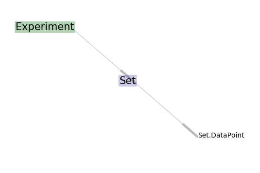
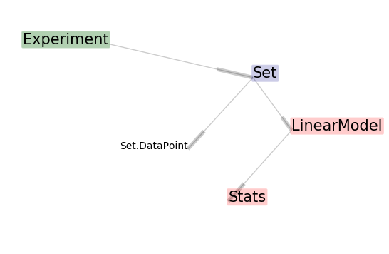

# Scenario: A Generic Experiment

This walkthrough describes the end-to-end steps for using datajoint.
For this example we will use high-level(generic) concepts for our
process elements to assist readers that might get bogged down in domain knowledge.

In this example we are scientists that want to make a bunch of observations on
 some phenomenon that has two attributes. We have a hunch that there is some
 correlation between the attributes and that one may be predictive of the other.

We will have to record our data and make sure we keep track of the following
ideas:

* Experiment - a simple experiment where we do a linear fit on some data
* Set - a collection of Datapoints for a particular experiment
* Datapoint - a single observation

How can we use datajoint to aid in organizing our data collection.

## Make sure DataJoint is configured for our Database.
Let's setup datajoint for this project.

First thing is you will need credentials to a database server that is running and setup for your access. https://datajoint.github.io/docs/dj/GettingStarted/prereqs.html#configuring-mysql-server

### Configuring your project's access to the database.

Let's configure access to that database server. Your process for configuring your connection might vary depending on your operating system. https://datajoint.github.io/docs/dj/GettingStarted/configure_conn.html

The easiest way to configure a new project's connection is to import datajoint.
This will create a new template file in you working directory.

```python
import datajoint as dj
DataJoint 0.4.6 (December 22, 2016)
Cannot find configuration settings. Using default configuration. To change that, either
    * modify the local copy of dj_local_conf.json that datajoint just saved for you
    * put a file named .datajoint_config.json with the same configuration format in your home
    * specify the environment variables DJ_USER, DJ_HOST, DJ_PASS
```
Open this file (datajoint_config.json) with a text editor, and make sure the credentials are correct for your database. You will probably need to replace the default values for:
* database.host
* database.user
* database.password

Save the file, hop back into python and try importing datajoint again. You should see a message confirming that the setting are loading from the local file that you just edited.

```python
import datajoint as dj
DataJoint 0.4.6 (December 22, 2016)
Loading local settings from dj_local_conf.json
```
Then verify the settings are valid by creating a connection. You should get a single message describing your database connection, and no errors.

```python
c = dj.conn()
Connecting rob@mydatabase.myinstitution.com:3306
```
Good job, your connection is configured.

### Defining the *Schema*
Alright, so we can now connect to the database server.

A database server is designed to serve many different databases for different users. Each of these specific databases has its own name and access privilege. Before we can save any of our data to the server, we will first need to tell datajoint which database it should use. This name should be something descriptive that helps to identify the type of data in its tables.

Note: for some institution servers you might need to use a specified naming convention to make sure your database user has the right privileges. For instance, you might need to have your username as a prefix for the database name. For example, the user "rob" might not have access to the database "experiment", but might be allowed to access any database beginning with "rob_", so "rob_experiment" would be ok.

The python code to define where our tables will live is:
```python
schema = dj.schema('rob_experiment', locals())
```
The first argument is the database name that we just thought up for our schema. Running this should produce no errors.

At this point all of the setup and configuration for our database use is complete and we can begin defining our python objects.


## Figure out the domain concepts / relations
After making sure the configuration is working, we get to start thinking about
the shape of the data we are collecting and how we want to use it.
Effective datajoint use depends on a having reasonable relation model for our data.
A relational model is a way of describing the shape of our data and how attributes relate to each other. This modeling skill takes some practice to develop, but you can get a jump start by using the following technique:

1. List off the types of data that you want to capture.
  * Examples: Scientist, Equipment, Trials, Model, Image, Tissue Sample
  * Use types that are specific to your research!
2. List any attributes about these data types that we might care about
  * Examples: A scientist might have a name, email, phone number. Equipment might have a last-serviced date
3. Describe how each data type relates to the others.
  * Examples: A trial can only happen with a scientist and an equipment. An image is created in a trial using a specific tissue sample.
**

We almost did this process above in the tutorial introduction when we described what we wanted our data capture. Lets describe the ideas further.

### Experiment
An experiment, we can arbitrarily decide that we want to start a new experiment. For our example, an Experiment really doesn't depend on existing data. We as scientists can decide that we want to run a new, exciting experiment. The types of attributes we wish to record solely about an Experiment are attributes that describe *what* the experiment is and attributes that *uniquely identify* a particular experiment.

```
Experiment
has an id
```

### Set
So in any particular experiment, we want to make a sequence of observations. Any dataset will be associated with a particular experiment, and it will have a collection of DataPoints that it owns.

```
Set
-> depends on an experiment
```

### Datapoint
This is a single observation, that has both an x and a y attribute. Any datapoint will be part of a dataset.

```
DataPoint
-> part of a dataset
has an x
has a y
```

This concludes the listing of the objects that we will be collecting data on.


## Defining our tables as python objects
After thinking about the relationships in our data, we can start implementing
python classes to represent the tables that will store our data. Datajoint has a simple mechanism for defining tables via classes. Here is an example that we will explain line-by-line.

### Experiment

```python
@schema
class Experiment(dj.Manual):
    definition = """ # A simple experiment.
    experiment_id: int
    ----
    """
```
Finished Experiment table shown first.

```
@schema
```
The @schema decorator is necessary for any python objects that we want to exist as tables in our database.

```
class Experiment(dj.Manual):
```
When defining our class, we need to specify what the table type is: manual, imported, part, or  computed. A more thorough description on each of the types is given in the documentation. https://datajoint.github.io/docs/dj/Documentation/tables.html#table-types

```
     definition = """ # A simple experiment.
```
The ```definition``` member of the Experiment class is where we will actually define the columns of the table. The first comment is used as a description of the table; in this case the table description is "A simple experiment".

```
    experiment_id : int
```
The next line in the definition tells datajoint that we want an attribute called ```experiment_id``` and that its type is ```int```.

```
    ----
```
This line is a bit sneaky in this example, but it is essential to how datajoint forms its relationships. The rule is: every attribute *above* the line is a primary key, and every attribute *below* is not. Remember, that a primary key is something that uniquely identifies a row in this table.

That's it. Lets define the rest of our tables.

### Set and DataPoint tables.

This is the code for creating the Set and DataPoint tables.


```python
@schema
class Set(dj.Imported):
    definition = """
    # A set of datapoints
    -> Experiment
    -----
    """
    class DataPoint(dj.Part):
        definition = """
        # Collected data.
        -> Set
        datapoint : int
        -----
        x : float
        y : float
        """
```
Finished tables first.

```
@schema
class Set(dj.Imported):
```
Defines the Set table as an Imported table. This is useful for instance if we were recording data in a different piece of software.

```
    definition = """
    # A set of datapoints
    -> Experiment
    -----
    """
```
Here is where the relationships that we described earlier will start being useful. The ```-> Experiment``` line means that datajoint will create a database relationship between the Experiment and Set tables. Described in further detail, the Set table will have the Experiment's primary key(experiment_id) in its own primary key tuple. For this example, any experiment will only have 1 dataset, so the experiment alone is sufficient to identify a dataset. This means that a dataset primary key is just (experiment_id).

```
    class DataPoint(dj.Part):
```
Part tables are useful because it allows the owning table to be responsible for importing all of the datapoints at once.

```
        definition = """
        # Collected data.
        -> Set
        datapoint : int
```
The definition of the DataPoint table. A datapoint belongs to a Set, so we specify that dependency with the arrow ```->```. A Set has many datapoints, so we also need to give some type of additional information to uniquely identify a datapoint. For this example, we label each datapoint with its order in how it was observed. The Set's primary key will be merged with the datapoint number to create the primary key for a DataPoint: (experiment_id, datapoint)

```
        -----
        x : float
        y : float
        """
```
Any datapoint has the attributes x and y, which are floating point numbers.

### Validating
At this point, we can plot our schemas relationships as a quick sanity check using the entity-relationship-diagram tool.


```python
dj.ERD(schema).draw()
```
This command should draw our three tables entities, and color them depending on their table type. The output will look something like:




Here is the full code at this point of the walkthrough.

```python
import datajoint as dj
schema = dj.schema('rob_experiment', locals())

@schema
class Experiment(dj.Manual):
    definition = """ # A simple experiment.
    experiment : int
    ----
    """


@schema
class Set(dj.Imported):
    definition = """
    # A set of datapoints
    -> Experiment
    -----
    """

    class DataPoint(dj.Part):
        definition = """
        # Collected data.
        -> Set
        datapoint : int
        -----
        x : float
        y : float
        """

dj.ERD(schema).draw()

```


## Inserting Data
Ok great - we have defined our table schema. Now how do we get data into
those tables? The experiment table is a ```manual``` table, and is the best
to start.

### Experiment

Insertion into a manual table is straight forward. Here is an example which will insert 3 experiments with ids 1, 2, and 3. ```skip_duplicates``` will prevent datajoint from complaining if we run this line of code multiple times.

```python
Experiment().insert(([1],[2],[3]), skip_duplicates=True)
```

### DataPoint
In this example DataPoint is a part table, so we don't insert them manually or individually via DataPoint().populate().


### Set
The Set class is an import table and is responsible for importing all of the
DataPoints that belong to it. For an ```import``` table, we need to define the
```_make_tuples(self, key)``` function. https://datajoint.github.io/docs/dj/Documentation/computed_tables.html?highlight=_make_tuples


Below is the Set class, updated with a psuedo-data import process. For this example we are just generating random data, but in reality this data would be read from an external source, e.g. website or local file. **Important** notice that Set class is responsible for inserting its DataPoints.

```python
@schema
class Set(dj.Imported):
    definition = """
    # A set of datapoints
    -> Experiment
    -----
    """

    class DataPoint(dj.Part):
        definition = """
        # Collected data.
        -> Set
        datapoint : int
        -----
        x : float
        y : float
        """

    def _make_tuples(self, key):
        n = 10
        mu = 0
        sigma = .1

        # Inserting the key that identifies this Set, into the Set table
        # will prevent this Set from being processed again (because its key
        # will be in the table.
        self.insert1(key)
        # We insert all of our datapoints via a single insert call.
        self.DataPoint().insert((
            dict(key,
                 datapoint=i,
                 x=i + np.random.normal(mu, sigma),
                 y=2*i + np.random.normal(mu, sigma))
                for i in range(n)))

```

After implementing ```_make_tuples()``` for our class, we can process any unimported Set tuples via

```python
Set().populate()
```

## Make sure the data is there.
We now have populated our data model. Let's make sure.

```python
Set.DataPoint()
```
Should produce output similar to the following:

```python
>>>  Experiment()

*experiment    *datapoint    x             y
+------------+ +-----------+ +-----------+ +-----------+
1              0             0.0649697     0.0852126
1              1             0.924946      1.8732
1              2             2.10859       3.93932
1              3             2.84353       5.88854
1              4             3.92722       7.93169
1              5             4.98611       9.99445
1              6             6.06824       11.9226
   ...
 (30 tuples)

```


# Analysis
Ok great, we have a bunch of data. This tutorial will now show how to use computed tables to help with analysis pipelines. If we had known our analysis ahead of time, we could have created these tables before capturing any data.

Let's create a linear model for the data, and compute some stats about each model that describe how good the fit is.

* LinearModel - y=mx+b where we find m and b from datapoints
* Stats - stats about how well a linear model fits some data.

## Figure out the relations
When expanding our schema, we still want to think about the data that we want to capture and how it relates to other data.

### LinearModel
In our analysis a LinearModel depends on a single Set and has a slope and an intercept attribute.

```
LinearModel
-> associated with a single Set
has a slope, m
has an intercept, b
```

### Stats
After a particular model is created, we know that we will want some type of information about how good it is. The model's stats will tell us what we want to know. In this case, our stats for a model will contain the mean-squared-error (MSE) and the R-squared value of the fit.

```
Stats
-> associated with a single LinearModel
has a MSE value
has a r^2 value
```
## Table definition
After identifying the relations and tables that we want to create, we can implement them as python classes.

### LinearModel tables.
LinearModel is a ```computed``` table, which means inside _make_tuples() we must define *how* it is computed.

```python
@schema
class LinearModel(dj.Computed):
    definition = """
    # fits line a DataCollection. y=mx+b form
    -> Set
    -----
    m : float     # Slope
    b : float     # intercept
    """
    def _make_tuples(self, key):
        X, Y = (Set.DataPoint() & key).fetch['x', 'y']
        X = np.stack([X, np.ones_like(X)], axis=-1)
        m, b = np.linalg.lstsq(X, Y)[0]
        self.insert1(dict(key, m=m, b=b))
```

### Stats table
Stats is a ```computed``` table, which means inside _make_tuples() we must define *how* it is computed.

```python
@schema
class Stats(dj.Computed):
    definition = """
    # Computes Mean Square Error and R2 for a particular Model
    -> LinearModel
    -----
    mse : float         # The MSE value.
    r2  : float         # R-squared of linear fit
    """
    def _make_tuples(self, key):
        X, Y =  (Set.DataPoint() & key).fetch['x', 'y']
        m, b = (LinearModel() & key).fetch1['m', 'b']
        yCalc = X*m + b
        self.insert1(
            dict(key,
                 mse=((Y - yCalc) ** 2).mean(axis=0),
                 r2=1-np.sum((Y - yCalc)**2)/np.sum((Y - np.mean(Y))**2)))
```
### Validating
Let's plot the ERD of our updated schema.

```python
dj.ERD(schema).draw()
```
This command should draw our five tables entities, and color them depending on their table type. The output will look something like:




## Populating the computed tables
After we have defined the new tables in our analysis pipeline, we still need to execute the populate command to start processing.

```python
LinearModel().populate()
Stats().populate()
```

## Results
We can inspect the results

```python
print(Stats())
*experiment    mse           r2
+------------+ +-----------+ +----------+
1              0.0168934     0.99949
2              0.0271251     0.999171
3              0.0403221     0.998783
 (3 tuples)

```


Full working code example can be found in [this jupyter notebook](ex1.ipyndb)
